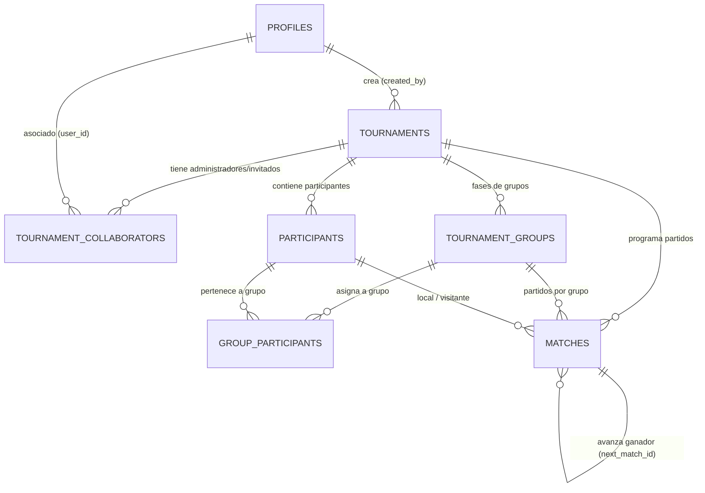

# TourneyPass ⚽🏆

Plataforma web para crear, organizar y gestionar torneos de fútbol (FIFA / EA Sports FC) entre amigos: ligas, copas eliminatorias y fases de grupos con estadísticas y tablas en tiempo real.

---

## 🎨 Identidad de Marca (Branding)

### 1. Nombre & Concepto
* **Nombre oficial**: **TourneyPass**
* **Slogan / Propósito**: *Tu pase a torneos de FIFA & EA Sports FC entre amigos.*
* **Personalidad de marca**: Competitiva, moderna y comunitaria. Inspirada en el ambiente de los torneos de eSports pero diseñada para los piques, la diversión y la camaradería entre amigos ("el tercer tiempo gamer").

---

### 2. Imagotipo y Activos Visuales
El isotipo fusiona la silueta de un **balón de fútbol geométrico** integrado en un **emblema digital / trofeo de torneo**, reforzado con acentos de luz neón sobre fondo oscuro.

* **Activos disponibles en `/public`**:
  * `public/logo.png`: Logotipo oficial con fondo transparente.
  * `public/logo.jpg`: Versión para fondos completos / avatares.
  * `public/favicon.ico`: Favicon multi-resolución para navegadores.
  * `public/apple-touch-icon.png`: Icono para dispositivos móviles y PWA.
  * `public/icon-192x192.png`: Icono para web app manifest.

---

### 3. Paleta de Colores Oficial ("Verde Cancha & Dark Stadium")

Diseñada con un modo oscuro inmersivo que evoca el césped iluminado bajo los reflectores de un estadio nocturno:

| Elemento | Nombre conceptual | Hex | Uso recomendado |
| :--- | :--- | :--- | :--- |
| **Primario** | Verde Cancha | `#22c55e` | Botones de acción principal (CTA), insignias destacadas, badges de victoria |
| **Primario Oscuro** | Campo Profundo | `#15803d` | Gradientes, sombras de acento, estados presionados |
| **Primario Hover** | Verde Brillante | `#4ade80` | Estados `:hover`, efectos glow, textos de énfasis |
| **Fondo Principal** | Verde Casi Negro | `#071a12` | Background global de la aplicación (`body`) |
| **Fondo Secundario** | Superficie Estadio | `#0d2419` | Header, footer, barras laterales de navegación |
| **Contenedores / Cards** | Tarjeta Cancha | `#122d20` | Cards de partidos, tablas de posiciones, modales |
| **Texto Principal** | Blanco Balón | `#f4f4ee` | Encabezados, títulos, marcadores principales |
| **Texto Secundario** | Gris Césped | `#b9c5bd` | Subtítulos, estadísticas secundarias, fechas |
| **Bordes & Líneas** | Línea de Cal | `#234334` | Divisores de tablas, bordes de tarjetas y tarjetas de fixture |

#### Tokens CSS (disponibles en `app/globals.css`)
```css
:root {
  --color-pitch: #22C55E;
  --color-pitch-dark: #15803D;
  --color-pitch-hover: #4ADE80;
  --color-field-bg: #071A12;
  --color-field-surface: #0D2419;
  --color-field-card: #122D20;
  --color-ball-white: #F4F4EE;
  --color-text-secondary: #B9C5BD;
  --color-field-border: #234334;
}
```

---

### 4. Tipografía & Estilo Visual

| Elemento | Tipografía | Peso / Estilo | Uso & Propósito |
| :--- | :--- | :--- | :--- |
| **Logo / Nombre** | `Barlow Condensed` | **800** (ExtraBold) | Impacto deportivo, identidad eSports |
| **H1 / H2** | `Barlow Condensed` | **700** (Bold) | Títulos de torneos, cabeceras principales |
| **Nombres de equipos** | `Barlow` | **600** (SemiBold) | Legibilidad limpia en tarjetas y listas |
| **Marcadores** | `Barlow Condensed` | **700** (Bold) | Números condensados estilo tablero de estadio |
| **Botones** | `Inter` | **600** (SemiBold) | Llamados a la acción (CTA), interactividad clara |
| **Tablas** | `Inter` | **400–600** (Regular/SemiBold) | Tablas de posiciones, fixtures, estadísticas densas |
| **Texto general** | `Inter` | **400** (Regular) | Párrafos, descripciones y contenido general |

* **Efectos de Iluminación & Estadio**:
  * Glow sutil verde césped (`glow-pitch`: `0 0 25px -5px rgba(34, 197, 94, 0.4)`).
  * Tarjetas con efecto vidrio esmerilado sobre verde profundo (`backdrop-blur-md` + borde `#234334`).

---

## 🗄️ Estructura de Base de Datos (Supabase / PostgreSQL)

La base de datos está modelada de forma relacional y normalizada en PostgreSQL a través de **Supabase**, con soporte nativo para **Row Level Security (RLS)**, triggers automáticos y gestión multi-administrador por torneo.

### Diagrama Entidad-Relación



---

### Tablas del Sistema

| Tabla | Propósito | Campos Clave |
| :--- | :--- | :--- |
| **`profiles`** | Perfil público de usuarios registrados (sincronizado automáticamente con `auth.users`). | `id` (PK, UUID), `email`, `full_name`, `avatar_url`, `created_at` |
| **`tournaments`** | Entidad central del torneo. Almacena formato, estado y configuraciones generales. | `id` (PK, UUID), `created_by` (FK `profiles`), `name`, `slug`, `format`, `status`, `is_public`, `settings` (JSONB) |
| **`tournament_collaborators`** | Permite invitar a otros usuarios/correos a co-administrar un torneo. | `id` (PK, UUID), `tournament_id` (FK `tournaments`), `user_id` (FK `profiles`, nullable), `invited_email`, `role`, `status` |
| **`participants`** | Equipos o jugadores del torneo. Admite participantes registrados o creados manualmente por el admin. | `id` (PK, UUID), `tournament_id` (FK `tournaments`), `user_id` (FK `profiles`, nullable), `name`, `seed`, `avatar_url` |
| **`tournament_groups`** | Grupos para torneos con fase de grupos (ej. "Grupo A", "Grupo B"). | `id` (PK, UUID), `tournament_id` (FK `tournaments`), `name` |
| **`group_participants`** | Tabla puente que asigna participantes a cada grupo. | `id` (PK, UUID), `group_id` (FK `tournament_groups`), `participant_id` (FK `participants`) |
| **`matches`** | Partidos programados o jugados (liga, grupo o playoffs). Permite enlazar llaves de copa con `next_match_id`. | `id` (PK, UUID), `tournament_id` (FK `tournaments`), `group_id` (FK `groups`), `stage`, `round_number`, `home_participant_id`, `away_participant_id`, `home_score`, `away_score`, `home_penalties`, `away_penalties`, `status`, `next_match_id`, `bracket_position` |

---

### Tipos y Enums Personalizados

* **`tournament_format`**: `'league'` (Liga / Todos contra todos), `'cup'` (Copa / Eliminación directa), `'group_playoff'` (Fase de grupos + PlayOff).
* **`tournament_status`**: `'draft'` (Borrador / Configuración), `'in_progress'` (En curso), `'completed'` (Finalizado), `'archived'` (Archivado).
* **`collaborator_role`**: `'owner'` (Dueño), `'admin'` (Administrador con permisos totales), `'editor'` (Editor de resultados y marcadores).
* **`collaborator_status`**: `'pending'` (Invitación enviada), `'accepted'` (Aceptada), `'declined'` (Rechazada).
* **`match_status`**: `'scheduled'` (Programado), `'live'` (En vivo), `'completed'` (Finalizado), `'cancelled'` (Cancelado), `'walkover'` (W.O.).

---

### Seguridad y Automatización (RLS & Triggers)

1. **Row Level Security (RLS)**:
   - **Lectura**: Cualquier usuario (incluso anónimos) puede visualizar torneos públicos, tablas, fixtures y partidos.
   - **Creación**: Cualquier usuario autenticado puede crear sus propios torneos.
   - **Edición / Gestión**: Controlada mediante funciones de seguridad (`is_tournament_admin` y `can_edit_tournament`), garantizando que solo el creador original o colaboradores aceptados puedan modificar participantes y resultados.
2. **Triggers Automáticos**:
   - **`on_auth_user_created`**: Al registrarse un usuario en Supabase Auth, se crea automáticamente su registro en `profiles` y se vinculan retroactivamente las invitaciones pendientes por email en `tournament_collaborators`.

---

## 🔐 Arquitectura de Autenticación (Supabase + Next.js 16)

La autenticación combina una experiencia fluida tipo SPA dentro de la plataforma con compatibilidad total para Server Components e invitaciones externas:

* **Server Components intactos**: `app/page.tsx` y `app/layout.tsx` se mantienen 100% como Server Components. El `<Header />` consulta la sesión en el servidor (`lib/supabase/server.ts`) y la inyecta al subcomponente interactivo `<AuthNav />` (`'use client'`).
* **Modal Interactivo con Portal**: Accesible desde el header en cualquier vista (`components/auth/auth-modal.tsx`). Se monta mediante `createPortal` en `document.body` para evitar restricciones de contenedor con `backdrop-blur`.
* **Página Dedicada (`/login`)**: Renderiza el formulario de acceso centrado para enlaces directos, invitaciones por correo a torneos o accesos externos.
* **Sesiones y Callbacks**:
  * `proxy.ts`: Proxy de Next.js 16 que refresca tokens y sincroniza cookies de sesión entre cliente y servidor.
  * `/auth/callback`: Ruta API para intercambio de código PKCE tras la confirmación de correo electrónico.

---

## 🚀 Estado del Proyecto
- [x] **Identidad de Marca & Branding** (Logo, Colores, Tipografías).
- [x] **Infraestructura Supabase** (Conexión Next.js App Router, SSR, proxy de sesiones).
- [x] **Modelo de Datos Relacional** (`001_initial_schema.sql` listo para migraciones).
- [x] **Autenticación UI** (Login, Registro y Estado de Sesión).
- [ ] **Creador y Gestor de Torneos** (Formularios de configuración y generador de fixtures).

